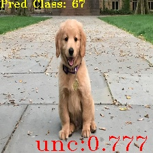
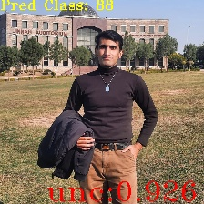
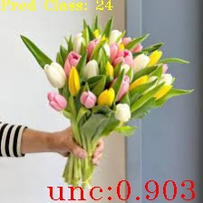
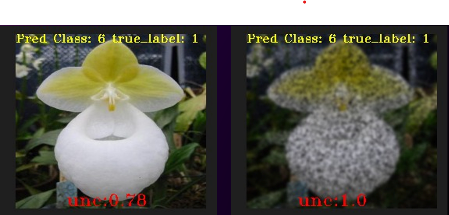
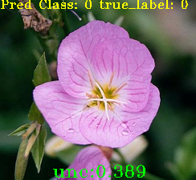
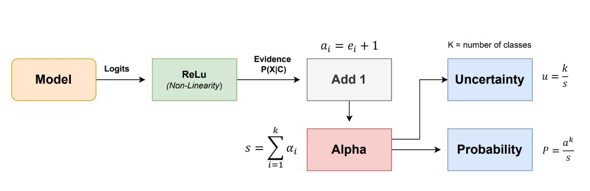
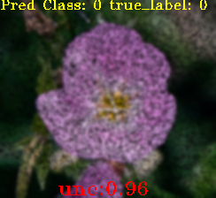
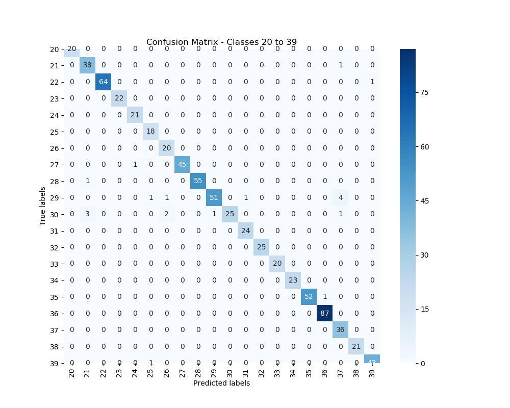
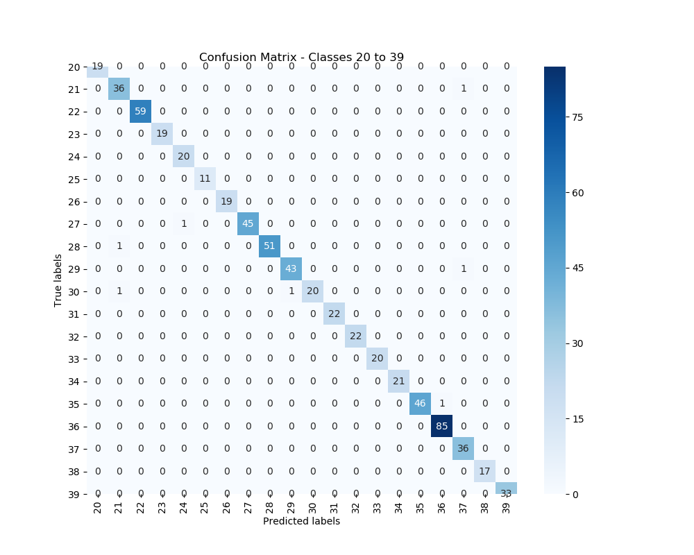

# Uncertainty Quantification using Evidential Deep Learning (EDL)

The official implementation of my computer vision semester project. Using ResNet50 model on Oxford Flowers102 dataset, I quantify uncertainty on out-of-distribution and noise-induced data to verify robustness of this method.
<p align="center">
  
  
  
</p>

<p align="center">
  
  
</p>

## What's New

- Added support of Noise Detection
- Added support of Confusion Matrix Visualization for effectiveness of uncertainty quantification to avoid wrong predictions
- Out of Distribution Data Detection
- Training and Testing scripts
  
## Method
- Replace Training Loss of ResNet with EDL loss adopted and inspired from [pytorch-classification-uncertainty](https://github.com/dougbrion/pytorch-classification-uncertainty.git)
- During Inference, the logits generated by our model will no longer be fed to SoftMax layer, but it will be interpreted as alpha parameters of Dirichlet distribution.
- Inspired from NVIDIA's tutorial on [Exploring Uncertainty Quantification in Deep Learning for Medical Imaging](https://www.nvidia.com/en-us/on-demand/session/gtcspring23-dlit51697/)
<p align="center">  

</p>

## Install

Assuming Linux Operating system,

##### Dataset Downloading and Extracting

Download the Oxford [Flowers102](https://www.robots.ox.ac.uk/~vgg/data/flowers/102/102flowers.tgz) dataset zip folder. Place the downloaded folder in directory data/images/ 
cd to data/images/ and place the following command to extract these images: tar -xvzf 102flowers.tgz.
Images will be saved in directory data/images/jpg

##### Environment Setup
Make a new python env
```bash
conda create -n unc python=3.8
conda activate unc
```
Run these commands after activating unc:
```bash
pip install torch==1.13.0+cu116 torchvision==0.14.0+cu116 torchaudio==0.13.0 --extra-index-url https://download.pytorch.org/whl/cu116
pip install matplotlib
pip install pandas
pip install opencv-python
pip install scikit-image
pip install scipy
```
## Results

We show the effectiveness of this approach to:
- Recognize OOD
- Perform Noise Detection
- Avoid Wrong Predictions 

## Results on Out of Distribution Data (OOD)
Use this command to infer custom OOD images stored in data/images/custom/ on model unc900.pth and store results in data/images/results/ 
```bash
python inference_custom.py 
```
For example, feeding in OOD (from data/images/custom) will result in:  
<p align="center">
  
  
  
</p>

## Results on Noise Detection (clear vs noisy images)
To compare your noising and denoising images uncertainty, run
```bash
python inference.py 
```
For example, uncertainty score on noisy vs clear image of one test set Flowers102 Image:  
<p align="center">
  
  
</p>

## Results on Avoiding Wrong Predictions
To run model's inference on test images of flower 102 and perform uncertainty filtering to give out confusion matrices, use
```bash
python confusion_matrix.py
```

For Example, more wrong predictions on confusion matrix (left) as compared to uncertainty filter (right)
<table>
  <tr>
    <th>No Uncertainty Filter</th>
    <th>Uncertainty Filter (0.65)</th>
  </tr>
  <tr>
    <td align="left">
      
    </td>
    <td align="center">
      
    </td>
  </tr>
</table>

## Training

##### Pretraining on CrossEntropy (MUST)
Pretraining on CrossEntropy is required to fine tune EDL loss. Upon my findings and experiments, this method does not work on scratch training with EDL loss. 
To start pretraining, run
```bash
python pretraining_50.py
```
It will save model named ce.pth which will be trained for 50 epochs with Cross Entropy Loss.

##### Fine-tuning EDL
To start training on ce.pth with custom loss function i.e. EDLLoss() for 500 epochs and lr = 2e-2 
```bash
python train_EDL500.py
```
This will save model named unc500.pth

To start training on unc500.pth with EDLLoss() for another 200 epochs with lr = 2e-5
```bash
Run python resume500_700.py 
```
This will save model named unc700.pth

To start training on unc700.pth with EDLLoss() for another 200 epochs with lr = 1e-2
```bash
Run python resume700_900.py 
```
This will save model named unc900.pth


## References

* [dougbrion/pytorch-classification-uncertainty](https://github.com/dougbrion/pytorch-classification-uncertainty)
  


